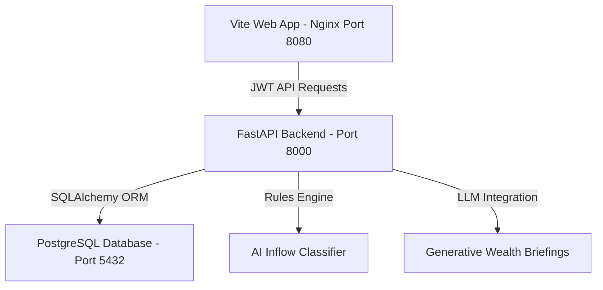

# SUYOGYA

> **SBI Agentic AI Digital Engagement Intelligence Platform**
> 
> *Knowing when to engage is more valuable than knowing what to sell.*

SUYOGYA is a state-of-the-art enterprise digital engagement intelligence platform designed for the State Bank of India. Built with Apple spatial UI aesthetics, high-performance web graphics, and strict enterprise code quality metrics, it maps HNI client readiness signals, explainable AI workflows, and advisory dispatches.

---

## 🏗️ System Architecture & Frameworks



### 1. Frontend Layer (`/src`)
- **Spatial UI Layout**: Implements glassmorphism panels, HSL tailored light/dark modes, and kinetic smooth scrolling (Lenis).
- **Core Views**:
  - *Login / Register*: Form validated JWT session gateway.
  - *Dashboard*: Real-time HNI business KPIs, dynamic alerts, and action widgets.
  - *Signal Stream*: Streaming ingestion signals list with client filters.
  - *Readiness Intelligence*: Signature interactive 3D particle sphere calibrated to client indices.
  - *Evidence Explorer*: Zoom/pan knowledge graph mapping supporting vectors.
  - *Reasoning Engine*: Interactive 8-stage stepper accordion showing confidence metrics and rejected options.
  - *Recommendation Center*: Action triggers for Approve (toast alerts), Reject (compliance textareas), Modify (allocation sliders), and Schedule (calendars).
  - *Channel Intelligence*: Interactive star-mesh topology displaying delivered volumes, latency, and Recharts performance.
  - *Compliance Center*: Governance timeline audit logs checked with secure SHA-256 integrity validation.
  - *Analytics Platform*: Multi-series Recharts forecast curves projecting next-quarter assets.
  - *System Monitoring*: Scrollable CLI console telemetry streaming live hardware variables.

### 2. Backend Services Layer (`/backend`)
- **FastAPI Core**: Uvicorn-hosted REST services with native Swagger integration (`/docs`).
- **PostgreSQL Database**: Persistent storage for HNW clients, recommendation allocation cards, and compliance records.
- **AI Orchestrator**: Manages inflow ingestion eligibility, applies portfolio match rule equations, and prompts simulated generative LLM wealth briefings.

---

## 🛠️ Technology Stack

- **Frontend Core**: React 18, TypeScript (Strict), Vite, React Router v6.
- **Backend Core**: Python 3.11, FastAPI, SQLAlchemy, psycopg2-binary, passlib, jose (JWT).
- **3D Graphics & Visuals**: Three.js, React Three Fiber (R3F), GSAP, Recharts.
- **Virtualization & Orchestration**: Docker, Docker Compose, Nginx.

---

## 🚀 Multi-Container Production Deployment Guide

SUYOGYA is pre-configured with a multi-container Docker compose architecture to streamline enterprise deployments.

### Prerequisites
- Node.js (version 20+) & npm (version 10+)
- Docker & Docker Compose

### 1. Build and Run the Complete Stack
1. Clone the repository and copy the env layout:
   ```bash
   git clone https://github.com/SriDesiyan/SUYOGYA.git
   cd SUYOGYA
   cp .env.example .env
   ```
2. Build and start database, FastAPI services, and Nginx web server:
   ```bash
   docker-compose up --build -d
   ```
3. Verify running containers:
   ```bash
   docker ps
   ```
   You should see three active services:
   - `suyogya-db` running PostgreSQL on port `5432`
   - `suyogya-backend` running FastAPI on port `8000`
   - `suyogya-web` running Vite/Nginx on port `8080`

### 2. Accessing the Platform
- **SBI RM User Interface**: Open [http://localhost:8080](http://localhost:8080)
- **API Swagger Documentation**: Open [http://localhost:8000/docs](http://localhost:8000/docs)
- **Seeded Credentials (Self-Sign-in)**:
  - Email: `rm@sbi.co.in`
  - Password: `sbi-admin-9042`

---

## 💻 Local Development Server

If you prefer to run services outside containers:

1. **Frontend App**:
   ```bash
   npm install
   npm run dev
   ```
   Vite server starts at [http://localhost:5173](http://localhost:5173).

2. **Backend App**:
   ```bash
   cd backend
   pip install -r requirements.txt
   uvicorn app.main:app --reload
   ```
   FastAPI server starts at [http://localhost:8000](http://localhost:8000).

---

## 🛡️ Quality Standards

Ensure compile checks pass before pushing changes:
```bash
# Verify ESLint formatting rules
npm run lint

# Verify strict TypeScript compilation
npm run typecheck

# Package production bundle
npm run build
```
Pre-commit checks are guarded by Husky hooks executing lint and type check scripts automatically.
